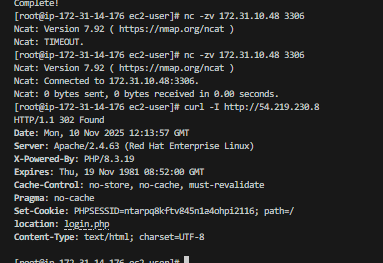

# DevOps Tooling Website - Setup Guide

## Table of Contents
- [Prerequisites](#prerequisites)
- [Step 1: NFS Server Configuration](#step-1-nfs-server-configuration)
- [Step 2: Database Server Setup](#step-2-database-server-setup)
- [Step 3: Web Servers Configuration](#step-3-web-servers-configuration)
- [Step 4: Testing and Verification](#step-4-testing-and-verification)
- [Step 5: Troubleshooting](#step-5-troubleshooting)

## Prerequisites

Before starting, ensure you have:

- AWS Account with appropriate permissions
- Basic understanding of Linux command line
- SSH client for connecting to EC2 instances
- Key pair for EC2 instance access

### AWS Resources Needed

- 5 EC2 instances (1 NFS server, 1 DB server, 3 web servers)
- VPC with subnet (e.g., 172.31.32.0/20)
- Security Groups configured appropriately
- 3 EBS volumes (10GB each) for NFS server

## Step 1: NFS Server Configuration

### 1.1 Launch EC2 Instance

Launch a Red Hat Enterprise Linux 8 EC2 instance with the following specifications:

- AMI: RHEL 8
- Instance Type: t2.small or larger
- Storage: Add 3 additional EBS volumes (10GB each)
- Security Group: Allow SSH (22), NFS (2049), RPC (111) from your subnet

### 1.2 Connect to the Instance

```bash
ssh -i your-key.pem ec2-user@<NFS-Server-Public-IP>
```

### 1.3 Configure Logical Volume Management (LVM)

**Verify attached volumes:**
```bash
lsblk
```

You should see three additional volumes (e.g., xvdf, xvdg, xvdh).

**Create Physical Volumes:**
```bash
sudo pvcreate /dev/xvdf /dev/xvdg /dev/xvdh
sudo pvs  # Verify physical volumes
```

**Create Volume Group:**
```bash
sudo vgcreate webdata-vg /dev/xvdf /dev/xvdg /dev/xvdh
sudo vgs  # Verify volume group
```

**Create Logical Volumes:**
```bash
sudo lvcreate -n lv-apps -L 9G webdata-vg
sudo lvcreate -n lv-logs -L 9G webdata-vg
sudo lvcreate -n lv-opt -L 9G webdata-vg
sudo lvs  # Verify logical volumes
```

**Format with XFS filesystem:**
```bash
sudo mkfs.xfs /dev/webdata-vg/lv-apps
sudo mkfs.xfs /dev/webdata-vg/lv-logs
sudo mkfs.xfs /dev/webdata-vg/lv-opt
```

**Create mount points and mount:**
```bash
sudo mkdir -p /mnt/apps
sudo mkdir -p /mnt/logs
sudo mkdir -p /mnt/opt

sudo mount /dev/webdata-vg/lv-apps /mnt/apps
sudo mount /dev/webdata-vg/lv-logs /mnt/logs
sudo mount /dev/webdata-vg/lv-opt /mnt/opt
```

**Verify mounts:**
```bash
df -h
```

**Make mounts persistent:**
```bash
sudo blkid  # Note the UUIDs

sudo vi /etc/fstab
```

Add these lines (replace UUIDs with your actual UUIDs):
```
UUID=<lv-apps-UUID> /mnt/apps xfs defaults 0 0
UUID=<lv-logs-UUID> /mnt/logs xfs defaults 0 0
UUID=<lv-opt-UUID> /mnt/opt xfs defaults 0 0
```

Test fstab configuration:
```bash
sudo mount -a
```

### 1.4 Install and Configure NFS Server

**Update system and install NFS:**
```bash
sudo yum -y update
sudo yum install nfs-utils -y
```

**Start and enable NFS service:**
```bash
sudo systemctl start nfs-server.service
sudo systemctl enable nfs-server.service
sudo systemctl status nfs-server.service
```

**Set permissions for NFS exports:**
```bash
sudo chown -R nobody: /mnt/apps
sudo chown -R nobody: /mnt/logs
sudo chown -R nobody: /mnt/opt

sudo chmod -R 777 /mnt/apps
sudo chmod -R 777 /mnt/logs
sudo chmod -R 777 /mnt/opt
```

**Restart NFS service:**
```bash
sudo systemctl restart nfs-server.service
```

### 1.5 Configure NFS Exports

**Get your subnet CIDR:**
```bash
ip addr show
```

Note your private IP and determine your subnet CIDR (e.g., 172.31.32.0/20).

**Configure exports:**
```bash
sudo vi /etc/exports
```

Add the following lines (replace with your subnet CIDR):
```
/mnt/apps 172.31.32.0/20(rw,sync,no_all_squash,no_root_squash)
/mnt/logs 172.31.32.0/20(rw,sync,no_all_squash,no_root_squash)
/mnt/opt 172.31.32.0/20(rw,sync,no_all_squash,no_root_squash)
```

**Export the shares:**
```bash
sudo exportfs -arv
```

**Verify exports:**
```bash
sudo exportfs -v
```

### 1.6 Configure Security Group

In AWS Console, configure the NFS server security group to allow:

- Type: NFS, Protocol: TCP, Port: 2049, Source: Your subnet CIDR
- Type: Custom TCP, Protocol: TCP, Port: 111, Source: Your subnet CIDR
- Type: Custom UDP, Protocol: UDP, Port: 111, Source: Your subnet CIDR
- Type: Custom UDP, Protocol: UDP, Port: 2049, Source: Your subnet CIDR

## Step 2: Database Server Setup

### 2.1 Launch EC2 Instance

Launch an Ubuntu 24.04 LTS EC2 instance:

- AMI: Ubuntu 24.04 LTS
- Instance Type: t2.micro or larger
- Security Group: Allow SSH (22), MySQL (3306) from your subnet

### 2.2 Connect to the Instance

```bash
ssh -i your-key.pem ubuntu@<DB-Server-Public-IP>
```

### 2.3 Install MySQL Server

**Update system:**
```bash
sudo apt update
sudo apt upgrade -y
```

**Install MySQL:**
```bash
sudo apt install mysql-server -y
```

**Start and enable MySQL:**
```bash
sudo systemctl start mysql
sudo systemctl enable mysql
sudo systemctl status mysql
```

### 2.4 Configure MySQL for Remote Access

**Edit MySQL configuration:**
```bash
sudo vi /etc/mysql/mysql.conf.d/mysqld.cnf
```

Find the line with `bind-address` and change it to:
```
bind-address = 0.0.0.0
```

**Restart MySQL:**
```bash
sudo systemctl restart mysql
```

### 2.5 Create Database and User

**Login to MySQL:**
```bash
sudo mysql
```

**Create database and user:**
```sql
CREATE DATABASE tooling;

CREATE USER 'webaccess'@'172.31.32.0/20' IDENTIFIED BY 'StrongPassword123!';

GRANT ALL PRIVILEGES ON tooling.* TO 'webaccess'@'172.31.32.0/20';

FLUSH PRIVILEGES;

SHOW DATABASES;

EXIT;
```

**Test remote connection from your local machine or another server:**
```bash
mysql -h <DB-Server-Private-IP> -u webaccess -p
```

### 2.6 Configure Security Group

In AWS Console, configure the database server security group to allow:

- Type: MySQL/Aurora, Protocol: TCP, Port: 3306, Source: Your subnet CIDR

## Step 3: Web Servers Configuration

Repeat these steps for all three web servers.

### 3.1 Launch EC2 Instances

Launch three Red Hat Enterprise Linux 8 EC2 instances:

- AMI: RHEL 8
- Instance Type: t2.small or larger
- Security Group: Allow SSH (22), HTTP (80) from anywhere (0.0.0.0/0)

### 3.2 Connect to Each Instance

```bash
ssh -i your-key.pem ec2-user@<Web-Server-Public-IP>
```

### 3.3 Install NFS Client

**Install NFS utilities:**
```bash
sudo yum install nfs-utils nfs4-acl-tools -y
```

### 3.4 Mount NFS Shares

**Create mount point:**
```bash
sudo mkdir -p /var/www
```

**Mount NFS share (replace with your NFS server private IP):**
```bash
sudo mount -t nfs -o rw,nosuid <NFS-Server-Private-IP>:/mnt/apps /var/www
```

**Verify mount:**
```bash
df -h | grep /var/www
```

**Make mount persistent:**
```bash
sudo vi /etc/fstab
```

Add this line (replace with your NFS server private IP):
```
<NFS-Server-Private-IP>:/mnt/apps /var/www nfs defaults 0 0
```

**Test fstab:**
```bash
sudo umount /var/www
sudo mount -a
df -h | grep /var/www
```

### 3.5 Install Apache and PHP

**Install Apache:**
```bash
sudo yum install httpd -y
```

**Install EPEL and Remi repositories:**
```bash
sudo yum install https://dl.fedoraproject.org/pub/epel/epel-release-latest-8.noarch.rpm -y
sudo yum install https://rpms.remirepo.net/enterprise/remi-release-8.rpm -y
```

**Enable PHP 7.4:**
```bash
sudo yum module reset php -y
sudo yum module enable php:remi-7.4 -y
```

**Install PHP and extensions:**
```bash
sudo yum install php php-opcache php-gd php-curl php-mysqlnd -y
```

**Verify PHP installation:**
```bash
php -v
```

**Start and enable Apache:**
```bash
sudo systemctl start httpd
sudo systemctl enable httpd
sudo systemctl status httpd
```

### 3.6 Deploy Application

**Install Git:**
```bash
sudo yum install git -y
```

**Clone the tooling repository:**
```bash
cd /tmp
git clone https://github.com/StegHub/tooling.git
```

**Deploy application files:**
```bash
sudo cp -R /tmp/tooling/html/* /var/www/html/
```

**Set proper ownership and permissions:**
```bash
sudo chown -R apache:apache /var/www/html/
sudo chmod -R 755 /var/www/html/
```

### 3.7 Configure Database Connection

**Edit the functions.php file:**
```bash
sudo vi /var/www/html/functions.php
```

Update the database connection details:
```php
$db = mysqli_connect('<DB-Server-Private-IP>', 'webaccess', 'StrongPassword123!', 'tooling');
```

### 3.8 Import Database Schema

**Import the database schema (run this only once from one web server):**
```bash
mysql -h <DB-Server-Private-IP> -u webaccess -p tooling < /var/www/html/tooling-db.sql
```

Enter the password when prompted.

### 3.9 Create Admin User

**Connect to MySQL and create admin user:**
```bash
mysql -h <DB-Server-Private-IP> -u webaccess -p tooling
```

```sql
INSERT INTO users (id, username, password, email, user_type, status)
VALUES (2, 'admin', '5f4dcc3b5aa765d61d8327deb882cf99', 'admin@example.com', 'admin', 1);

SELECT * FROM users;

EXIT;
```

Note: The password hash '5f4dcc3b5aa765d61d8327deb882cf99' is the MD5 hash of 'password'.

### 3.10 Configure SELinux

**Set SELinux booleans to allow Apache to connect to network and use NFS:**
```bash
sudo setsebool -P httpd_can_network_connect 1
sudo setsebool -P httpd_use_nfs 1
```

**Restart Apache:**
```bash
sudo systemctl restart httpd
```

### 3.11 Configure Security Group

In AWS Console, configure the web server security group to allow:

- Type: HTTP, Protocol: TCP, Port: 80, Source: 0.0.0.0/0
- Type: HTTPS, Protocol: TCP, Port: 443, Source: 0.0.0.0/0 (for future use)

## Step 4: Testing and Verification

### 4.1 Test NFS File Synchronization

**On Web Server 1:**
```bash
sudo touch /var/www/html/test-from-web1.txt
ls -la /var/www/html/
```

**On Web Server 2:**
```bash
ls -la /var/www/html/
```

You should see the `test-from-web1.txt` file created from Web Server 1.

*


*On NFS Server:**
```bash
ls -la /mnt/apps/html/
```

The file should also be visible on the NFS server.

### 4.2 Test Database Connectivity

**From any web server:**
```bash
mysql -h <DB-Server-Private-IP> -u webaccess -p -e "SELECT * FROM tooling.users;"
```

You should see the admin user you created.

### 4.3 Test Web Application

**Access the application from your browser:**

Open your web browser and navigate to:
```
http://<Web-Server-1-Public-IP>
http://<Web-Server-2-Public-IP>
http://<Web-Server-3-Public-IP>
```

All three URLs should display the same DevOps Tooling website.

**Login to the application:**
- Username: `admin`
- Password: `password`

You should be able to log in successfully and see the dashboard.

### 4.4 Verify All Services

**On NFS Server:**
```bash
sudo systemctl status nfs-server
sudo exportfs -v
```

**On Database Server:**
```bash
sudo systemctl status mysql
sudo mysql -e "SHOW DATABASES;"
```

**On Web Servers:**
```bash
sudo systemctl status httpd
df -h | grep /var/www
```

## Step 5: Troubleshooting

### Issue 1: 403 Forbidden Error

**Symptoms:**
- Browser shows "403 Forbidden" when accessing the website

**Solutions:**

**Check file permissions:**
```bash
sudo chmod -R 755 /var/www/html/
sudo chown -R apache:apache /var/www/html/
```

**Check SELinux settings:**
```bash
sestatus
sudo setsebool -P httpd_can_network_connect 1
sudo setsebool -P httpd_use_nfs 1
```

**Check Apache error logs:**
```bash
sudo tail -f /var/log/httpd/error_log
```

**Verify Apache is running:**
```bash
sudo systemctl status httpd
sudo systemctl restart httpd
```

### Issue 2: NFS Mount Fails

**Symptoms:**
- Cannot mount NFS share
- Mount command hangs or times out

**Solutions:**

**On NFS Server - Check NFS service:**
```bash
sudo systemctl status nfs-server
sudo systemctl restart nfs-server
sudo exportfs -arv
```

**Verify exports:**
```bash
sudo exportfs -v
showmount -e localhost
```

**Check firewall/security group:**
```bash
sudo firewall-cmd --list-all
```

Ensure ports 2049 and 111 (TCP/UDP) are open in AWS Security Group.

**On Web Server - Test connectivity:**
```bash
ping <NFS-Server-Private-IP>
telnet <NFS-Server-Private-IP> 2049
showmount -e <NFS-Server-Private-IP>
```

**Check mount:**
```bash
df -h | grep /var/www
mount | grep /var/www
```

**Remount if needed:**
```bash
sudo umount /var/www
sudo mount -a
```

### Issue 3: Database Connection Failed

**Symptoms:**
- Cannot connect to MySQL from web servers
- Application shows database connection error

**Solutions:**

**Test connection:**
```bash
mysql -h <DB-Server-Private-IP> -u webaccess -p
```

**On Database Server - Check MySQL status:**
```bash
sudo systemctl status mysql
sudo systemctl restart mysql
```

**Verify bind address:**
```bash
sudo cat /etc/mysql/mysql.conf.d/mysqld.cnf | grep bind-address
```

Should be `bind-address = 0.0.0.0`

**Check user permissions:**
```bash
sudo mysql -e "SELECT user, host FROM mysql.user WHERE user='webaccess';"
sudo mysql -e "SHOW GRANTS FOR 'webaccess'@'172.31.32.0/20';"
```

**Check firewall/security group:**

Ensure port 3306 is open in AWS Security Group for your subnet CIDR.

**Check MySQL logs:**
```bash
sudo tail -f /var/log/mysql/error.log
```

### Issue 4: Changes Not Syncing Across Servers

**Symptoms:**
- Files created on one web server don't appear on others

**Solutions:**

**Verify NFS mount on all servers:**
```bash
df -h | grep /var/www
mount | grep /var/www
```

**Check NFS mount options:**
```bash
cat /etc/fstab | grep /var/www
```

**Remount NFS share:**
```bash
sudo umount /var/www
sudo mount -a
```

**Check NFS server exports:**
```bash
# On NFS server
sudo exportfs -v
```

**Test file creation:**
```bash
# On Web Server 1
sudo touch /var/www/html/test-$(hostname).txt

# On Web Server 2
ls -la /var/www/html/
```

### Issue 5: Apache Won't Start

**Symptoms:**
- Apache service fails to start
- systemctl status shows failed state

**Solutions:**

**Check Apache configuration:**
```bash
sudo apachectl configtest
```

**Check error logs:**
```bash
sudo tail -50 /var/log/httpd/error_log
```

**Check if port 80 is already in use:**
```bash
sudo netstat -tulpn | grep :80
sudo lsof -i :80
```

**Verify Apache is installed:**
```bash
rpm -qa | grep httpd
```

**Reinstall if necessary:**
```bash
sudo yum reinstall httpd -y
```

### Issue 6: PHP Not Working

**Symptoms:**
- PHP files download instead of executing
- PHP code visible in browser

**Solutions:**

**Verify PHP is installed:**
```bash
php -v
rpm -qa | grep php
```

**Check Apache PHP module:**
```bash
sudo yum install php -y
```

**Restart Apache:**
```bash
sudo systemctl restart httpd
```

**Create test PHP file:**
```bash
echo "<?php phpinfo(); ?>" | sudo tee /var/www/html/info.php
```

Access `http://<Web-Server-IP>/info.php` in browser.

### Issue 7: SELinux Blocking Access

**Symptoms:**
- Permission denied errors in Apache logs
- Cannot access files even with correct permissions

**Solutions:**

**Check SELinux status:**
```bash
sestatus
getenforce
```

**Set required booleans:**
```bash
sudo setsebool -P httpd_can_network_connect 1
sudo setsebool -P httpd_use_nfs 1
sudo setsebool -P httpd_can_network_connect_db 1
```

**Check SELinux logs:**
```bash
sudo tail -f /var/log/audit/audit.log | grep denied
```

**Temporarily disable SELinux for testing (not recommended for production):**
```bash
sudo setenforce 0
```

**Re-enable SELinux:**
```bash
sudo setenforce 1
```

## Best Practices and Security Recommendations

### Production Considerations

**NFS Security:**
- Use `root_squash` instead of `no_root_squash` in production
- Restrict exports to specific IP addresses rather than entire subnets
- Consider NFSv4 with Kerberos authentication
- Use VPN or private network for NFS traffic

**File Permissions:**
- Avoid 777 permissions in production
- Use 755 for directories, 644 for files
- Set proper ownership (apache:apache for web files)

**Database Security:**
- Use strong passwords (minimum 12 characters, mixed case, numbers, symbols)
- Restrict user access by specific IP addresses
- Grant only necessary privileges (avoid GRANT ALL)
- Enable SSL/TLS for MySQL connections
- Regular backups and updates

**Web Server Security:**
- Configure SELinux properly (don't disable it)
- Keep Apache and PHP updated
- Implement HTTPS with SSL/TLS certificates
- Hide PHP version in headers
- Disable directory listing
- Implement rate limiting

**Network Security:**
- Use Security Groups to restrict access
- Implement Network ACLs for additional layer
- Use private subnets for database and NFS servers
- Enable VPC Flow Logs for monitoring

### Monitoring and Maintenance

**What to Monitor:**
- Web server CPU, memory, disk usage
- NFS server performance and capacity
- Database connections and query performance
- Application errors and access logs
- Network traffic and latency

**Regular Maintenance:**
- Apply security updates regularly
- Monitor disk space on NFS server
- Review and rotate logs
- Test backup and restore procedures
- Review security group rules

### Backup Strategy

**What to Backup:**
- Database (daily automated backups)
- NFS data (/mnt/apps, /mnt/logs)
- Web server configurations
- SSL certificates

**Backup Methods:**
- AWS EBS snapshots for volumes
- MySQL dumps with mysqldump
- rsync for file backups
- Automated backup scripts with cron

**Example MySQL backup:**
```bash
mysqldump -h <DB-IP> -u webaccess -p tooling > tooling_backup_$(date +%Y%m%d).sql
```

**Example NFS backup:**
```bash
sudo tar -czf /tmp/nfs_backup_$(date +%Y%m%d).tar.gz /mnt/apps
```

## Next Steps

After successfully implementing this solution, consider:

1. **Add Load Balancer:** Implement AWS Application Load Balancer for traffic distribution
2. **Automate with IaC:** Use Terraform or CloudFormation for infrastructure provisioning
3. **Configuration Management:** Use Ansible for automated server configuration
4. **Implement CI/CD:** Set up Jenkins or GitHub Actions for automated deployments
5. **Add Monitoring:** Deploy Prometheus and Grafana for comprehensive monitoring
6. **Implement HTTPS:** Add SSL/TLS certificates for secure communications
7. **Database Replication:** Set up MySQL Master-Slave replication
8. **Containerization:** Migrate to Docker and Kubernetes

## Additional Resources

- [NFS Server Configuration Guide](https://access.redhat.com/documentation/en-us/red_hat_enterprise_linux/8/html/managing_file_systems/exporting-nfs-shares_managing-file-systems)
- [MySQL Documentation](https://dev.mysql.com/doc/)
- [Apache HTTP Server Documentation](https://httpd.apache.org/docs/)
- [AWS EC2 User Guide](https://docs.aws.amazon.com/ec2/)
- [SELinux User's and Administrator's Guide](https://access.redhat.com/documentation/en-us/red_hat_enterprise_linux/8/html/using_selinux/)

---

**Last Updated:** 2025-11-10
**For questions or issues, please refer to the main [README.md](./README.md)**

